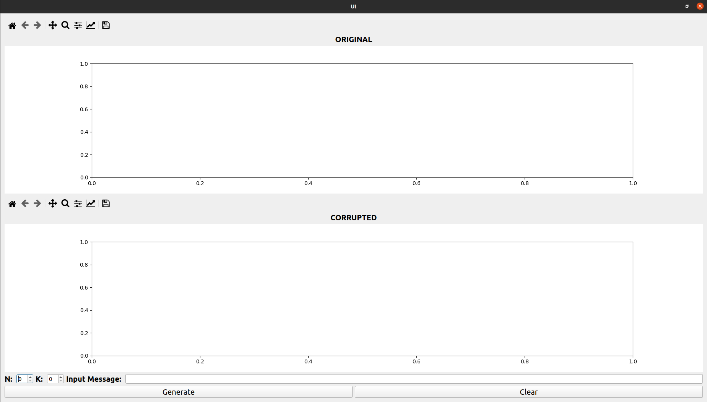
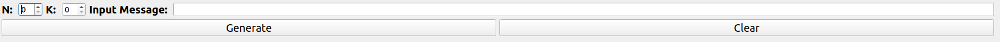
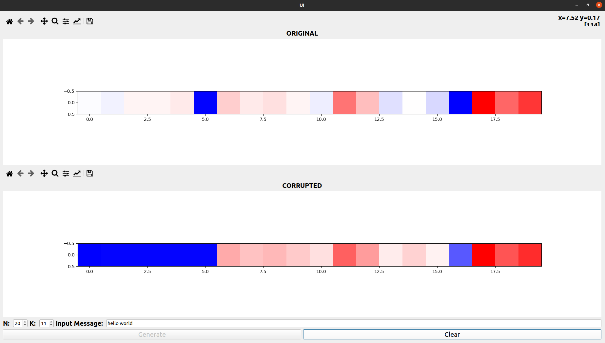

# Learning Reed Solomon Codes

## Overview
While thinking about ways to encode/decode values from the [Poses and Braids project](https://github.com/BnZel/poses_and_braids). I thought about using the theory behind QR codes: Reed Solomon codes. I was simply interested in how data can be stored and transferred efficiently and wanted to implement this algorithm. Though most often, I like to create a small graphical user interface to further reinforce my knowledge.

## Resources
* Code credited to [Wikiversity: Reed-Solomon codes for coders](https://en.wikiversity.org/wiki/Reed%E2%80%93Solomon_codes_for_coders)
* PyQT5 
* Matplotlib
* Numpy

***NOTE: Due to the complexity of RS codes, I encourage the reader to refer to the wiki for a better explanation***

## Project In Detail
Start of the program when loading in


### From the wiki, RS takes the following parameters:
* prim is the primitive binary polynomial (default to 0x11d) to build the antilog and log tables (gf_exp and gf_log)
* Message Input
* n represents block size
* k represents message size   (n > k) & k = length of the message

### From the GUI:
The source code provided by the wiki is put into a class (QR) and is then plotted using a pixel plot to provide a visual of which values of the message is tampered with. In this GUI, it defaults from 0 to 5:

```python
    # From the QR.py
    self.corrupt_mesecc[0] = 0
    self.corrupt_mesecc[1] = 2
    self.corrupt_mesecc[2] = 2
    self.corrupt_mesecc[3] = 2
    self.corrupt_mesecc[4] = 2
    self.corrupt_mesecc[5] = 2
```


```python
    # From rs_gui.py  
    def generate(self):
        n = self.txtN.value()
        k = self.txtK.value()
        input = self.txtInputMsg.text()

        if (n <= k) or (input == ''):
            msgError = QMessageBox()
            msgError.setIcon(QMessageBox.Critical)
            msgError.setText("Error")

            msgError.setInformativeText('Text fields cannot be empty and n must be greater than k...')
            msgError.setWindowTitle("Error")
            msgError.exec_()
        else:
            self.qr = QR(n, k, input)

            mesecc = np.array(self.qr.mesecc_temp)                      # using the original message values
            mesecc = np.expand_dims(mesecc, axis=0)                     # to be able to plot 

            meseccCorrupt = np.array(self.qr.mesecc_temp_corrupt)       # corrupted message
            meseccCorrupt = np.expand_dims(meseccCorrupt, axis=0)       

            self.plot(mesecc, meseccCorrupt)                            # plotting the original and corrupted message values

    def plot(self, dataA, dataB):
        self.im1 = self.ax1.imshow(dataA, cmap='bwr', interpolation='None')
        self.canvas.draw()

        self.im2 = self.ax2.imshow(dataB, cmap='bwr', interpolation='None')
        self.canvas2.draw()

        self.btnGenerate.setDisabled(True)
```

### Demo of The GUI


## Conclusion
While this may not cover all the topics on Reed Solomon codes (perhaps inconclusive), it helped myself have a better understanding of the techniques used to store data in a compact way.